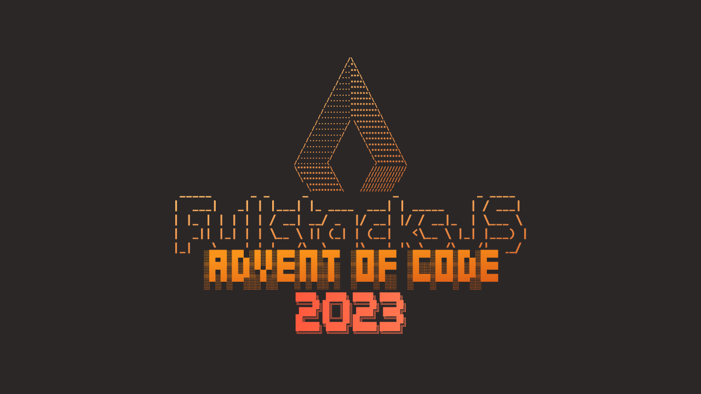

## Advent of Code 2023

Welcome to the Advent of Code 2023 Solutions Repository for the FullstacksJS Community! 🎉

In this repository, we encourage all community members to contribute their solutions to the Advent of Code 2023 Challenge. This collaborative effort allows us to showcase our coding skills and learn from each other.

## How to Contribute

1. **Fork this Repository**: Click the "Fork" button in the top-right corner of this repository to create your own copy.

2. **Clone your Fork**: Use `git clone` to create a local copy of your fork on your computer.

3. **Create your Solution**: Inside the respective `solutions` directory, copy the template file for your language to the solution directory and change it to your GitHub username (e.g., `solutions/01-trebuchet/<username>.js`). If the template does not exit you can create one following [How to create a template](#how-to-create-a-template) section.

4. **Add Your Solutions**: Add your solutions for part one and part two to the file.

5. **Test your solution**: Run the test script against your solution `./test solutions/01-trebuchet/<username>.js`.

6. **Commit and Push**: Commit your changes and push them to your fork on GitHub.

7. **Create a Pull Request**: Open a Pull Request (PR) from your fork to this main repository.

## How to create a template

Templates serve as foundational structures for different programming languages or runtime environments. Their primary role is to offer a compatible CLI for execution and testing of solutions. When creating a template, follow these guidelines:

**Executable Entry File**: Each template must have an entry file. This file should be executable and designed to accept two command-line arguments:

```
  <template> <1|2> [example]
```
The first argument denotes the 'part number' of the problem (e.g., Part 1 or Part 2).
The second argument indicates whether the solution should be run with example data or actual data.

**Input File Handling**: The template should be capable of reading input data from files. These input files are located in the input directory. Based on the provided arguments, the template should determine which specific input file to use.

**Solution Implementation Placeholder**: Include designated sections or placeholders within the template for implementing the solutions for Part 1 and Part 2 of the problem and output the result to the `stdout` based on the arguments.

To create a new one just create an executable file with the name of your language/runtime inside the `solutions/00-template` directory (e.g. `solutions/00-template/c.c`), and at the end run the test script against it (e.g. `test solutions/00-template/c.c`).

## Code of Conduct

[FullstacksJS Rules Page](https://fullstacksjs.com/en/rules)

Happy coding!
